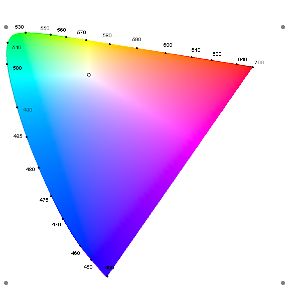

## Reflectance, Color

* Before doing reflection or absorption measurements with fiber cables: 
connect light source by fiber cable to a collimator. Then position collimator to shine on mirror such a way, that light is approximatelly centered in the cage on the way to spectrograph slit.

### Specular (mirror like)

* Use stand with fiber connectors. 
* -45 to + 45 geometry
    - Fiber from lamp connects to one connector (let say -45 degree)
    - Second fiber is connected to +45 degree. The other end is connected to collimator and directed toward the scpectrometer
* Reflection/Backscatter geometry
    - Use Reflection/Backscatter Probe (we have [Thorlabs RP 20](https://www.thorlabs.com/newgrouppage9.cfm?objectgroup_id=7794))
    - [see examples of use](https://www.thorlabs.com/newgrouppage9.cfm?objectgroup_id=7794))
* Put a white standard (see bellow)
* Take spectrum with white standard in place 
* Take spectrum with a sample of interest in place (the same distance from fiber cables)
* Calculate reflectance spectrum of a surface under study as (signal from surface)/(signal from white standard)

### Diffuse reflection, Albedo, Color

* https://en.wikipedia.org/wiki/Diffuse_reflection

* Albedo (Latin albedo, "whiteness") is the measure of diffusive reflection of radiation out of the total radiation received by a body ([wiki](https://en.wikipedia.org/wiki/Albedo), [hyperphysics](http://hyperphysics.phy-astr.gsu.edu/hbase/phyopt/albedo.html))

* Albedo of various surfaces [image](http://ieeexplore.ieee.org/mediastore/IEEE/content/media/5503869/8080325/8063403/saive1-2756068-large.gif) from [here](http://ieeexplore.ieee.org/document/8063403/figures)

* Example on how to find an albedo of a surface can be found [here](http://eprints.lancs.ac.uk/6736/1/inproc_326.pdf)

* [theory](http://nvlpubs.nist.gov/nistpubs/jres/80A/jresv80An4p567_A1b.pdf)

_Video of reflection measurements_ [here](https://www.spectroscopytv.com/perform-a-reflectance-spectroscopy-measurement/)

#### Color, Diffisive reflection, Albedo, Measurement

* Use stand with fiber connectors. 
* -45 to top geometry. Or even off-reflection-plane
    - Fiber from lamp connects to one connector (let say -45 degree)
    - Second fiber is connected to top connector. (if you use would use +45 degree, specular reflection can play a a big role). The other end is connected to collimator and directed toward the scpectrometer. 
    - Even better, if you can position second fiber off the relfection plane, to minimize effects of specular reflection (see [link](https://www.researchgate.net/file.PostFileLoader.html?id=57d5ac92f7b67e05927eb848&assetKey=AS%3A405210573885440%401473621138023))
    - The other end is connected to collimator and directed toward the scpectrometer
* Reflection/Backscatter geometry
    - Use Reflection/Backscatter Probe (we have [Thorlabs RP 20](https://www.thorlabs.com/newgrouppage9.cfm?objectgroup_id=7794))
    - [see examples of use](https://www.thorlabs.com/newgrouppage9.cfm?objectgroup_id=7794))
* Put a white standard (see bellow)
* Take spectrum with white standard in place 
* Take spectrum with a sample of interest in place (the same distance from fiber cables)
* Calculate reflectance spectrum of a surface under study as (signal from surface)/(signal from white standard)
    
### White standards and Lambertian reflectance

* What is white - see this [discussion](https://www.quora.com/Paper-is-white-because-it-reflects-all-light-and-mirrors-reflect-all-light-so-why-dont-they-look-the-same)
* [Lambertian reflectance](https://en.wikipedia.org/wiki/Lambertian_reflectance) - an ideal "matte" or diffusely reflecting surface. 
    - Closest to an ideal Lambertian surface - [Spectralon](https://en.wikipedia.org/wiki/Spectralon)
    - Another material - [Optical PFTE](https://www.google.com/url?sa=t&rct=j&q=&esrc=s&source=web&cd=2&cad=rja&uact=8&ved=0ahUKEwjS_rHbpqTZAhUBk1kKHbHLAy4QFghIMAE&url=https%3A%2F%2Fwww.berghof-fluoroplastics.com%2Ffileadmin%2FDateien-Einpflege%2FSeitenbaum%2FHome-Downloads%2FProdukte%2FPTFE-Produkte%2FOptisches%2520PTFE%2FBerghof_PTFE-Products_Optical-PTFE.pdf&usg=AOvVaw2De5nHstkNF2Fyq8akJizD)

### Internal reflection info

* http://mmrc.caltech.edu/FTIR/Literature/Reflectance%20IR%20Khoshhesab.pdf

### Other general info

* [Diffuse Reflectance IR and UV-vis Spectroscopy, by Friederike Jentoft](https://www.researchgate.net/file.PostFileLoader.html?id=57d5ac92f7b67e05927eb848&assetKey=AS%3A405210573885440%401473621138023)
* Integrating spheres - see Fig. 14 [here](http://mmrc.caltech.edu/FTIR/Literature/Reflectance%20IR%20Khoshhesab.pdf)

### Color

#### CIE 1931

Color can be represented using different systems of coordinates. For example following International Commission on Illumination (CIE):

  - CIE 1931 RGB color space
  - CIE 1931 XYZ color space
  - given spectal data of I vs wavelength XYZ values can be calcualed using simple integration [see how](https://en.wikipedia.org/wiki/CIE_1931_color_space#Computing_XYZ_From_Spectral_Data)
  in CIE XYZ, Y parameter is a measure of the luminance (aka brightness) of a color
  - The co-ordinates x-small and y-small are calculated from ratios of the XYZ tristimulus values.
The two axes for a plot are: x which is horizontal, and y which is vertical. The x and y are lower-case. Unfortunately it cannot show luminance. In order to show luminance, Y (upper-case) from CIE XYZ may be used. In this case it becomes known as  'xyY'. __Colours in the chromaticity diagram are not perceptually uniform__. [source](http://www.colourphil.co.uk/xyz_colour_space.shtml)
  - Image of CIE 1931 color space chromaticity diagram is here [link](https://en.wikipedia.org/wiki/CIE_1931_color_space#/media/File:CIE1931xy_blank.svg)
  

#### CIE 1976

  - In colorimetry, the CIE 1976 (L*, u*, v*) color space, commonly known by its abbreviation CIELUV, is a color space adopted by the International Commission on Illumination (CIE) in 1976, as a simple-to-compute transformation of the 1931 CIE XYZ color space, but which attempted __perceptual uniformity__. For details see [this](https://en.wikipedia.org/wiki/CIELUV). 
  - CIE 1976 color space bellow created using Wolfram Mahtematica - see function ChromaticityPlot.
  

