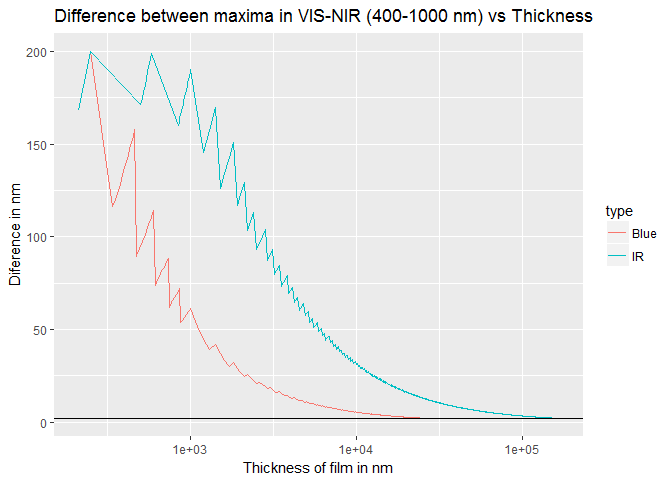

### Thickness of thin films

### Theory

Given air, film, air situation. One relfection with n2>n1 (thus + 
$1/2 \lambda$). Condition for maxima then $$ (m+1/2)\lambda = 2 n d$$ . 

#### Range of thickness 

$$\lambda_{m+1}-\lambda_{m} = \frac{2 n d}{m+1+1/2} - \frac{2 n d}{m+1/2} = \frac{2nd}{0.75+2 m + m^2}$$

Based on this formula we can make a plot (bellow) to see for which values of thickness we can expect to see interference pattern. 

  * Assuming n = 1.5
  * Assuming spectrometer sesitivity in 400-1000 nm range
  * Assuming patter is detectable if difference between peaks is at least 2 nm (~10 dots given 0.21 nm resolution), and at most 200 nm (larger pattern may be difficult to observe reliably)
  * Testing for wide range of m values
  * Blue - means difference near blue spectral end, IR - near IR spectral end
  * Obtained range is ~ 200 nm - 160 um
  * This is only estimation. Using the full avaialbe to spectrometer spectrum of 200-1050 nm, and not limiting pattern with 200 nm, smaller thickness can be detected.

<!-- -->

#### Determining a thickness

We get values of $\lambda$ for maxima from spectrum, but how to get m? It may happen that situation of m = 1 is somewhere in IR. For example given n =1.5 and d = 1 um,  $\lambda$ corresponding to m = 1 will be 2 um.  Thus we replace $m$ by $m + m_0$. Where $m_0$ is unknown "shift of $m$". THis way we can start counting m from the first peak we oberve in long wavlength.

$$ (m + m_0 +1/2) \lambda = 2 n d$$

Make linear equation $$1/\lambda = [\frac{1}{4nd}+ \frac{m_0}{2nd} ] + m \frac{1}{2nd}$$

Fit this linear regression to obtain d from the slope $d = \frac{1}{2* n * slope}$  ($m_0$ then can be obtained from an intercept if needed)

From standard error of slope you can get standard error of d, usign [error propagation](https://en.wikipedia.org/wiki/Propagation_of_uncertainty)

### If index of refraction is not known

If you do not know the refractive index of your material you can measure the interference pattern perpendicularly to your film (as usually) and at other incident angle. You can then calculate refractive index from the shifts of extrema in your measured pattern ([link](https://www.researchgate.net/post/How_to_calculate_thin_film_thickness_from_UV-VIS-NIR_spectrometer_interference_data)).

This can be done using fiber probes

#### Using probes

Measurements can be done in Reflection/Backscatter geometry, or in -45 to +45 degrees position 

* Use stand with fiber connectors. 
* -45 to + 45 geometry
    - Fiber from lamp connects to one connector (let say -45 degree)
    - Second fiber is connected to +45 degree. The other end is connected to collimator and directed toward the scpectrometer
* Reflection/Backscatter geometry
    - Use Reflection/Backscatter Probe (we have [Thorlabs RP 20](https://www.thorlabs.com/newgrouppage9.cfm?objectgroup_id=7794))
    - [see proper conenction](https://www.thorlabs.com/newgrouppage9.cfm?objectgroup_id=7794))

### Updated sample holder under objective in transmission mode
  
  * Use SLS lamp -> int.sphere->mirror to supply light from underneath. 

### Usign sample positioned on the way of the beam (transmission)

  * Put sample vertically near notch filters
  
### Usign sample positioned under ojbective (reflection)
  * shine SLS lamp toward objective using 50/50 mirror in filter wheel
  * focus and send reflection to spectrometer
  * mapping can be pefrormed using manual or aruduino enabled control of maunal stage
      * For mapping first use another (mapping) application to collect spectra at several positions
      * Files will be saved in Andor format - use batch convert to csv (asc) files
      * Then specify folder in this application, containing csv files

#### Simulator of what you expect to see based on theory

  * https://www.filmetrics.com/reflectance-calculator

#### For interpretaion - see theory and examples:

  * Reflection:
  http://oceanoptics.com//wp-content/uploads/App-Note-Thickness-Measurement-of-ARC-and-Silicon-Thin-Films.pdf
  
  * Transmission
  http://oceanoptics.com//wp-content/uploads/App-Note-Transmission-Measurements-of-Polymer-Thin-Films.pdf
  
### Other theory  

  * https://www.sciencedirect.com/science/article/pii/0040609085902731
  * https://www.physics.rutgers.edu/~podzorov/technical%20notes%20on%20thickness%20measurements_020114.pdf
  * https://www.researchgate.net/post/How_to_calculate_thin_film_thickness_from_UV-VIS-NIR_spectrometer_interference_data
  * https://www.perkinelmer.com/CMSResources/Images/44-153901APP_Thin-films.pdf
  * https://www.shimadzu.com/an/uv/support/uv/ap/film.html
  * https://wcam.engr.wisc.edu/Public/Tools/Analysis/Filmetrics%20F20%20technical%20reference.pdf
  
